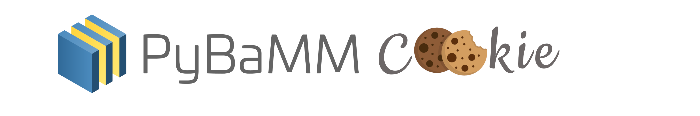

# pybamm-cookie

<!-- TODO: configure badges -->

<!-- [![Actions Status][actions-badge]][actions-link]
[![Documentation Status][rtd-badge]][rtd-link]

[![PyPI version][pypi-version]][pypi-link]
[![Conda-Forge][conda-badge]][conda-link]
[![PyPI platforms][pypi-platforms]][pypi-link]

[![GitHub Discussions][github-discussions-badge]][github-discussions-link]

[actions-badge]:            https://github.com/pybamm-team/pybamm-cookie/workflows/CI/badge.svg
[actions-link]:             https://github.com/pybamm-team/pybamm-cookie/actions
[conda-badge]:              https://img.shields.io/conda/vn/conda-forge/pybamm-cookie
[conda-link]:               https://github.com/conda-forge/pybamm-cookie-feedstock
[github-discussions-badge]: https://img.shields.io/static/v1?label=Discussions&message=Ask&color=blue&logo=github
[github-discussions-link]:  https://github.com/pybamm-team/pybamm-cookie/discussions
[pypi-link]:                https://pypi.org/project/pybamm-cookie/
[pypi-platforms]:           https://img.shields.io/pypi/pyversions/pybamm-cookie
[pypi-version]:             https://img.shields.io/pypi/v/pybamm-cookie
[rtd-badge]:                https://readthedocs.org/projects/pybamm-cookie/badge/?version=latest
[rtd-link]:                 https://pybamm-cookie.readthedocs.io/en/latest/?badge=latest -->


<!-- SPHINX-START -->
[](http://numfocus.org)
[](https://github.com/copier-org/copier)
[](https://github.com/pybamm-team/pybamm-cookie)
[](https://pypi.org/project/pybamm-cookie/)
[](https://github.com/pybamm-team/pybamm-cookie/actions/workflows/test_on_push.yml)

This repository contains a `copier` template for battery modeling projects using PyBaMM, released under the [BSD-3-Clause license](https://github.com/pybamm-team/pybamm-cookie/blob/main/LICENSE). Currently under active development.

## 📄 Using `pybamm-cookie`

### Generating projects with `pybamm-cookie`

#### Manually using copier

Install `copier` and `jinja2_time` extension using `pip`.
```bash
pip install copier jinja2-time
```
Generate a project from the `pybamm-cookie` template.

```bash
copier copy https://github.com/pybamm-team/pybamm-cookie.git . --trust
# this will generate the project in the current working directory
copier copy https://github.com/pybamm-team/pybamm-cookie.git path_to_copy_to/ --trust
# this will generate the project in the specified path
```
#### Using pipx (recommended)

You can generate a project by executing the `pipx run` command which doesn't need any package installations.
```bash
pipx run pybamm-cookie --path /path_to_copy_to
```

Or if you wish to install the `pybamm-cookie` package and then generate a project, you could do so with the help of following commands.
```bash
pipx install pybamm-cookie  # or pip install pybamm-cookie
```
Navigate into the directory you want your project directory to reside in, or use `--path` argument to explicitly mention the path where you want your project to be generated.
```bash
pybamm-cookie --path /path_to_copy_to
```
#### Using pip/pip inside venv

You can also perform a normal `pip` installation for the `pybamm-cookie` CLI and generate a project.
```bash
pip install pybamm-cookie
pybamm-cookie
```

Copier will prompt you with various configurations and you may choose the ones that suit your use case.
Additionally you can perform `pybamm-cookie -h` to know the list of actions you can perform with the CLI.

> [!NOTE]
> A `git` repository is automatically initialised when a project is created within a directory. To push the contents to the upstream GitHub repository, create a GitHub repository with the same name as your local repository and do not initialise your GitHub repository with any files such as licenses or README which might conflict with the local repository, follow these steps as listed in the [GitHub documentation](https://docs.github.com/en/migrations/importing-source-code/using-the-command-line-to-import-source-code/adding-locally-hosted-code-to-github#adding-a-local-repository-to-github-using-git).

After generation, you can navigate to the generated project and run `nox -s generated-project-tests` to ensure if the project units are working as intended.

### Installing the `pybamm-cookie` project

This refers to the project used for the development of this template. There are two ways to install this project: either through `nox` or `pip`. `nox` uses `uv pip` or `pip` internally, and in this case, creates a virtual environment for you to activate.
To install, navigate to the root directory of this repository and execute either of these commands:

`nox -s dev`
or
`pip install -e .[dev]`

To check if the project was successfully installed, import the project inside Python.

```python
import pybamm_cookie

pybamm_cookie.__version__
```
### Project Layout
```bash
.
├── .github
│   └── workflows
├── docs
│   └── _static
├── src
│   ├── pybamm_example_project
│   ├── models
│   │   └── input
│   └─ parameters
│       └── input
├── tests
│    ├── generated_project_tests
│    └── user_tests
├─ noxfile.py
└─ pyproject.toml
```
A basic generated project with `pybamm-cookie` has a directory structure like the one depicted above. Each directory has a special purpose and is highly recommended to use them for their specific purposes to avoid any errors.
- `docs/` contains the basic configuration for building documentation using [sphinx](https://www.sphinx-doc.org/).
- `src/` contains the main package files under a directory with your specified project name. This is where all your code should be written.
    - `models/input/` - Contains the source code for battery models. Refer [PyBaMM models](https://docs.pybamm.org/en/latest/source/api/models/index.html) to learn how to write your own battery models.
    - `parameters/input/` - Contains the source code for parameters sets. Refer [PyBaMM parameter sets](https://docs.pybamm.org/en/stable/source/api/parameters/parameter_sets.html) to learn more on parameter sets.
- `tests/` The tests directory contains two sub-directories -
    - `generated_project_tests/` - Contains pre-defined tests for verifying if the units inside generated project work well. It can be verified using `nox -s generated-project-tests` or `pytest tests/generated_project_tests` command.
    - `user_tests/` - This directory contains all the user written tests, the example tests can be copied and modified as per your own needs. We suggest you use [pytest](https://docs.pytest.org/en/stable/) to write tests. The tests can be then run by executing `nox -s user-tests` or `pytest tests/user_tests`.
- `noxfile.py` contains basic `nox sessions` for building documentation and runnings tests.
- `pyproject.toml` has project metadata and build backend configurations.
- `github/workflows/` has all the basic CI configurations to automate tests and builds on [GitHub Actions](https://github.com/features/actions).

## 🚀 Motivation

This project aims to enhance the usability of PyBaMM for both newcomers and experienced users alike by providing standardised templates that incorporate best practices and automation tools. The `pybamm-cookie` template is set to lower the barrier to battery modeling, making it easier for the research community to adopt PyBaMM for their battery modeling projects. The project also supports model entry points and parameter set entry points, allowing community contributors to create and share models/parameter sets of their repositories using the copier template without directly adding them upstream. This lets community contributors retain ownership and choose license terms and also grants flexibility to the PyBaMM team in supporting models. Support for all of GitHub’s functionality and infrastructure is contained within the template.

## 🛠️ Contributing to `pybamm-cookie`

If you'd like to help us develop `pybamm-cookie` by improving the template's features, writing documentation, or fixing embarrassing bugs, please have a look at these [guidelines](https://github.com/pybamm-team/pybamm-cookie/blob/main/CONTRIBUTING.md).

## 📫 Get in touch

For any questions, comments, suggestions or bug reports, please see the
[contact page](https://www.pybamm.org/community).

## 📃 License

The `pybamm-cookie` project is open source code. For more information about its license, see [LICENSE](https://github.com/pybamm-team/pybamm-cookie/blob/main/LICENSE).

## ✨ Credits
This project is highly inspired by these two projects -
- [SciCookie](https://github.com/osl-incubator/scicookie), a cookiecutter template developed by [Open Science Labs](https://opensciencelabs.org/) to provide a boilerplate to generate Python based projects with a hassle free experience.
- [scientific-python/cookie](https://github.com/scientific-python/cookie), a project that supports copier/cookiecutter/cruft template generation for new Python projects based on Scientific Python developer guide.
<!-- SPHINX-END -->
